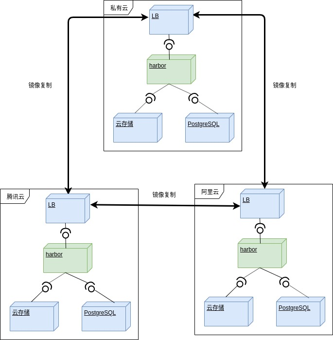
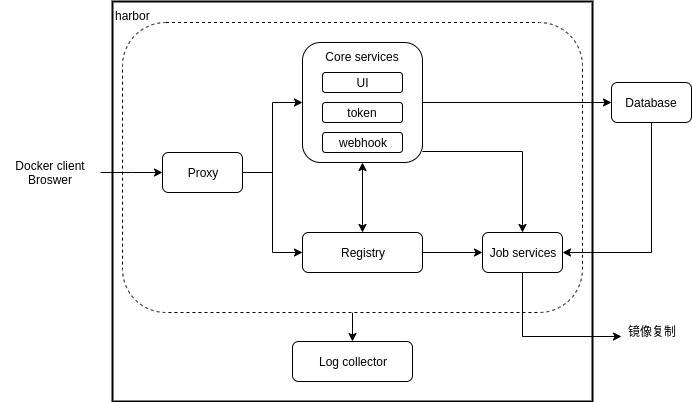

# harbor
本文整合了harbor部署，升级，软硬件需求和测试相关文档。

部署主要是参照官方的部署文档，采用online部署的模式来安装harbor组件。为了简化参数修改，增加了prepre.sh脚本。

官方1.7.0部署参照：https://github.com/goharbor/harbor/blob/v1.7.0/docs/installation_guide.md

## 部署图


绿色部分属于harbor部署范围，harbor包含的组件参照[组件](#组件)章节中的实线框内的部分。同一个site内可以部署多个harbor来达到高可用的目的。初期部署一个。

蓝色部分由云平台提供：
* 负载均衡器
* 共享存储
* PostgreSQL
* 部署harbor组件所用的服务器（服务器如软硬件配置参照[软硬件需求](#软硬件需求)）

## 组件
Harbor在架构上主要由6个组件构成：
1. Proxy：Harbor的registry, UI, token等服务，通过一个前置的反向代理统一接收浏览器、Docker客户端的请求，并将请求转发给后端不同的服务。
2. Registry： 负责储存Docker镜像，并处理docker push/pull 命令。由于我们要对用户进行访问控制，即不同用户对Docker image有不同的读写权限，Registry会指向一个token服务，强制用户的每次docker pull/push请求都要携带一个合法的token, Registry会通过公钥对token 进行解密验证。
3. Core services： 这是Harbor的核心功能，主要提供以下服务：
+ UI：提供图形化界面，帮助用户管理registry上的镜像（image）, 并对用户进行授权。
+ webhook：为了及时获取registry 上image状态变化的情况， 在Registry上配置webhook，把状态变化传递给UI模块。
+ token 服务：负责根据用户权限给每个docker push/pull命令签发token. Docker 客户端向Regiøstry服务发起的请求,如果不包含token，会被重定向到这里，获得token后再重新向Registry进行请求。
4. Database：为core services提供数据库服务，负责储存用户权限、审计日志、Docker image分组信息等数据。我们采用外部数据库。
5.ob Services：提供镜像远程复制功能，可以把本地镜像同步到其他Harbor实例中。
6. Log collector：为了帮助监控Harbor运行，负责收集其他组件的log，供日后进行分析。
各个组件之间的关系如下图所示：


## 软硬件需求
参照
https://github.com/goharbor/harbor/edit/master/docs/1.10/install-config/installation-prereqs.md
### 硬件

|Resource|Minimum|Recommended|
|---|---|---|
|CPU|2 CPU|4 CPU|
|Mem|4 GB|8 GB|
|Disk|40 GB|160 GB|

### 操作系统
|OS|
|---|
|CentOS 7.4 / Ubuntu 18.04|

安装和升级是基于ubuntu 18.04验证的。
为了和泰山新村保持版本一致，推荐Centos 7.4

### 软件
|Software|Version|
|---|---|
|Docker engine|Version 17.06.0-ce+ or higher|
|Docker Compose|Version 1.18.0 or higher|
|Openssl|Latest is preferred|

## 部署手册
```
# git clone https://gitlab.oneitfarm.com/hl/harbor.git
# cd harbor
# vim custom.cfg
根据实际环境信息修改配置文件。
__DOMAIN=test.harbor.com
__UI_URL_PROTOCOL=https
__WORK_DIR=/data/
__CERT_DIR=cert/
__HARBOR_ADMIN_PASSWORD=Harbor12345
__DB_HOST=192.168.3.2
__DB_PASSWORD=123456
__DB_PORT=5432
__DB_USER=postgres

# ./prepare.sh
# ./install.sh
```

## 升级
下面的步骤是从v1.7.0升级到v1.7.5的步骤。升级到其他步骤，需要修改对应的tag。
参照：https://github.com/goharbor/harbor/blob/v1.7.5/docs/migration_guide.md
假设harbor所在目录为${work_dir}
```
cd ${work_dir}/harbor
docker-compose down

mkdir -p /my_backup_dir
cd ..
mv harbor /my_backup_dir/harbor

cp -r /data/database /my_backup_dir/

docker pull goharbor/harbor-migrator:v1.7.5

wget https://storage.googleapis.com/harbor-releases/release-1.7.0/harbor-online-installer-v1.7.5.tgz

tar -zxvf harbor-online-installer-v1.7.5.tgz
cd harbor 

cp /my_backup_dir/harbor/harbor.cfg ./
harbor_cfg=“${work_dir}/harbor/harbor.cfg”
docker run -it --rm -v ${harbor_cfg}:/harbor-migration/harbor-cfg/harbor.cfg goharbor/harbor-migrator:1.7.5 --cfg up

./install.sh
```
升级过程中采用的是数据库目录整体备份，如果要用数据库工具备份，参照[PostgreSQL升级](./postgre.md#postgre备份)。

阿里云数据迁移步骤：
https://help.aliyun.com/document_detail/96785.html?spm=a2c4g.11174283.6.942.6c165b83eVvMxW

腾讯云数据迁移步骤：
https://cloud.tencent.com/document/product/409/4997


## 回滚
参照：https://github.com/goharbor/harbor/blob/v1.7.5/docs/migration_guide.md#roll-back-from-an-upgrade
```
cd ${work_dir}
rm harbor -rf
mv /my_backup_dir/harbor harbor
cp -r /my_backup_dir/database /data
cd /harbor
./install.sh
```
升级过程中采用的是数据库目录整体备份，如果要用数据库工具恢复，参照[PostgreSQL恢复](./postgre.md#postgre恢复)。

## registry压力测试
参照：https://docs.openstack.org/developer/performance-docs/test_results/container_repositories/registry2/index.html
```
# git clone https://gitlab.oneitfarm.com/hl/harbor.git
# cd harbor
# vi test.py
修改test.py里的并发数，habor信息
# python test.py
```
在测试目录下会生成测试报告。后缀为csv的是测试结果。


## 创建https证书
- 获得证书授权

```
cd /data/cert/
openssl genrsa -out ca.key 4096
openssl req -x509 -new -nodes -sha512 -days 3650 -subj "/C=NJ/ST=NanJing/L=NanJing/O=example/OU=Personal/CN=test.harbor.com" -key ca.key -out ca.crt
```

- 获得服务器证书

假设您的注册表的**主机名**是test.harbor.com，并且其DNS记录指向您正在运行Harbor的主机。在生产环境中，您首先应该从CA获得证书。在测试或开发环境中，您可以使用自己的CA. 证书通常包含.crt文件和.key文件，例如test.harbor.com.crt和test.harbor.com.key

```
1.创建自己的私钥
openssl genrsa -out test.harbor.com.key 4096

2.生成证书签名请求
openssl req -sha512 -new -subj "/C=NJ/ST=NanJing/L=NanJing/O=example/OU=Personal/CN=test.harbor.com" -key test.harbor.com.key -out test.harbor.com.csr

3.生成注册表主机的证书
cat > v3.ext <<-EOF
authorityKeyIdentifier=keyid,issuer
basicConstraints=CA:FALSE
keyUsage = digitalSignature, nonRepudiation, keyEncipherment, dataEnciphermentopenssl x509 -in certificate.pem -text -noout
extendedKeyUsage = serverAuth 
subjectAltName = @alt_names

[alt_names]
DNS.1=test.harbor.com
DNS.2=test.harbor
DNS.3=harbor
IP.1=192.168.3.2
IP.2=192.168.3.3
EOF

再执行下面命令
openssl x509 -req -sha512 -days 3650 -extfile v3.ext -CA ca.crt -CAkey ca.key -CAcreateserial -in test.harbor.com.csr -out test.harbor.com.crt
```

## nginx负载均衡配置
1. harbor部署， 参照！[部署手册](#部署手册)

2. nginx配置
增加一个文件，/etc/nginx/conf.d/harbor.conf，内容如下
```
upstream harbor {
    ip_hash;                    # 策略为ip_hash
    server 192.168.3.2:8443;    # 指定harbor的IP：Port
    server 192.168.3.3:8443;
}
server {
   listen       80;
   # 提供访问的域名或者IP
   server_name  test.harbor.com;
   return      308 https://$host$request_uri;
}
server {
    listen  443 ssl;
    server_name test.harbor.com;

    # SSL 证书
    ssl_certificate ./certs/harbor.crt;     # 测试环境需要手动生成， 参照！[创建https证书](#创建https证书)
    # SSL 私钥
    ssl_certificate_key ./certs/harbor.key;
    client_max_body_size 0;
    chunked_transfer_encoding on;

    location / {
        proxy_set_header X-Forwarded-For $proxy_add_x_forwarded_for;
        proxy_set_header Host $host;
        proxy_set_header X-Forwarded-Proto https;
        proxy_redirect off;
        proxy_ssl_verify off;
        proxy_ssl_session_reuse on;
        proxy_pass https://harbor;
        proxy_http_version 1.1;
}
    location /v2/ {
        proxy_pass https://harbor/v2/;
        proxy_set_header Host $host;
        proxy_set_header X-Real-IP $remote_addr;
        proxy_set_header X-Forwarded-For $proxy_add_x_forwarded_for;
        proxy_set_header X-Forwarded-Proto $scheme;
        proxy_ssl_verify off;
        proxy_ssl_session_reuse on;
        proxy_buffering off;
        proxy_request_buffering off;
    }
}
```
3. 启动nginx
```
nginx -s
```

4. 测试
* 浏览器访问https://test.harbor.com/
* docker login 成功
```
# docker -D login -u admin -p Harbor12345 test.harbor.com
......
Login Succeeded
```

## 灾难恢复
某那个site内的harbor挂掉之后，无法通过同步数据。
* 首选可以采用恢复harbor的方式。恢复harbor只需要重新执行./install.sh脚本即可。
* 如果harbor无法恢复，可以通过启动一个registry容器，并挂载/data/registry。通过registry提供的接口来拉取镜像。
其中/data/registry/是registry挂载的目录。该目录在共享存储上。
```
# docker run 
-d --name=registry  \
-v /data/registry/:/var/lib/registry  \
-p 5000:5000 docker.io/registry

# docker pull 127.0.0.1:5000/test/nginx:latest
```

## harbor_api工具
该工具是针对harbor v1.7.0的工具，由于各个版本的API有变化，所以其他版本不能用此工具。
该工具提供的功能有：
1. 打印所有项目
```
# python harbor_api_tools.py --list-projects
```

2. 打印所有仓库
```
# python harbor_api_tools.py --list-target
```

3. 创建仓库
```
# python harbor_api_tools.py --create-target --target=<target_name> --endpoint=<endpoint> --username=<username> --password=<password>
```

4. 创建复制任务
kind目前支持"Manual"和“Immediate”
```
# python harbor_api_tools.py --create-policy --target_id=<target_id> --project_id=<project_id> --policy=<policy_name> --kind=<kind>
```